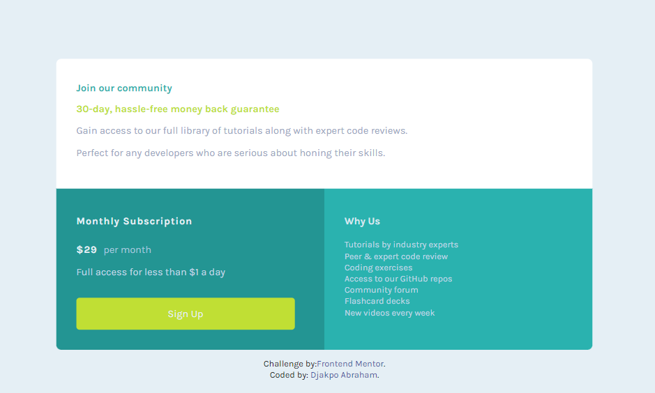

# Frontend Mentor - Single price grid component solution

This is a solution to the [Single price grid component challenge on Frontend Mentor](https://www.frontendmentor.io/challenges/single-price-grid-component-5ce41129d0ff452fec5abbbc). Frontend Mentor challenges help you improve your coding skills by building realistic projects. 

## Table of contents

- [Overview](#overview)
  - [The challenge](#the-challenge)
  - [Screenshot](#screenshot)
  - [Links](#links)
- [My process](#my-process)
  - [Built with](#built-with)
  - [What I learned](#what-i-learned)
  - [Continued development](#continued-development)
  - [Useful resources](#useful-resources)
- [Author](#author)

## Overview

### The challenge

Users should be able to:

- View the optimal layout for the component depending on their device's screen size
- See a hover state on desktop for the Sign Up call-to-action

### Screenshot

 

### Links

- Solution URL: (https://github.com/Mbrimes/single-price-grid-component.git)
- Live Site URL: (https://price-grid-site.netlify.app/)

## My process

### Built with

- Semantic HTML5 markup
- CSS custom properties

### What I learned

I learnt basic application of HTML and CSS in creating a static web page. 

### Continued development
I would continue focusing and Learning more on css and how to use other frameworks for building web pages.

### Useful resources

- [Resource 1](https://www.sololearn.com) - This helped me for for acquring basic knowledge of html and css. I really liked the platform and the pattern of teaching and will use it going forward.
- [Resource 2](https://www.w3school.com) - This is an amazing website which helped me finally understand html and css. I'd recommend it to anyone still learning this concept.

## Author

- Frontend Mentor - [@Marabs](https://www.frontendmentor.io/profile/Marabs)
- Twitter - [@Marabs123](https://www.twitter.com/Marabs123).
